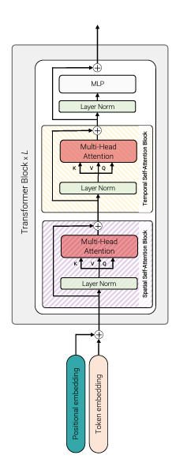

# ViViT

## Embedding Video Clips
* 
* 

## Transformer model for Video
### Model 1: Spatio-temporal attention
* This model simply forwards all spatio-temporal tokens extracted from the video, $z_0$, through the transformer encoder

### Model 2: Factorised encoder
* 

### Model 3: Factorized self-attention
* \
Factorised self-attention (Model 3). Within each transformer block, the multi-headed self-attention operation is factorised into two operations (indicated by striped boxes) that first only compute self-attention spatially, and then temporally\
* 

### Model 4: Factorised dot-product attention
* 

---
***Spatial Attention: Across H and W dimension\
Temporal Attention:   Across T dimension***

---

## Ablation
### Model Varients
* 
* The unfactorised model (Model 1) performs the best on Kinetics 400. However, it can also overfit on smaller datasets such as Epic Kitchens, where we find our “Factorised Encoder” (Model 2) to perform the best
* 